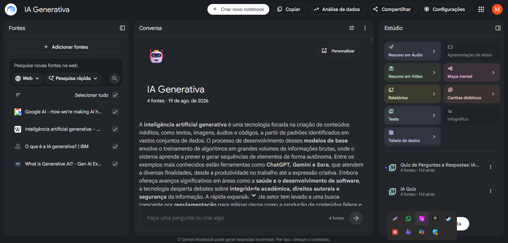

# 📚 Miniguia de Estudos com NotebookLM

## 🎯 Contexto e Objetivos

Este projeto foi desenvolvido como parte do desafio da DIO utilizando o NotebookLM como ferramenta de aprendizagem ativa.

### Tema Escolhido
Inteligência Artificial Generativa.

### Objetivos de Estudo

- Entender os conceitos fundamentais da IA Generativa.
- Conhecer aplicações práticas da tecnologia.
- Desenvolver habilidades de pesquisa e curadoria de fontes.
- Organizar o conhecimento em um material de consulta.

---

## 📖 Curadoria de Fontes

### Fonte 1
[Google AI](https://ai.google/)

### Fonte 2
[Wikipedia - Inteligência Artificial Generativa](https://pt.wikipedia.org/wiki/Intelig%C3%AAncia_artificial_generativa)

### Fonte 3
[IBM - Generative AI](https://www.ibm.com/br-pt/think/topics/generative-ai)

### Fonte 4
[AWS - O que é IA generativa](https://aws.amazon.com/what-is/generative-ai/?trk=24f8dce7-3b98-4598-b07f-6e50b430ac72&sc_channel=ps&ef_id=51464f25e3751356c25425a3dc104101:G:s&msads_camp=487441821&msads_ag=1151190521794109&msads_ad=71949576455592&msads_kw=what%20is%20generative%20ai&msads_matchtype=e&msads_network=o&msads_device=c&msads_geo={LocationId}&msclkid=51464f25e3751356c25425a3dc104101)

---

## 💬 Engenharia de Prompts

### Prompt 1

> Quais são os principais conceitos presentes nas fontes.

**Resultado:**

A Inteligência Artificial Generativa (ou IA Generativa) e suas tecnologias de suporte baseiam-se em um conjunto de conceitos fundamentais que explicam seu funcionamento, arquiteturas, aplicações e limitações. De acordo com as fontes apresentadas, os principais conceitos são:
IA Generativa vs. IA Tradicional (Predicativa): A IA tradicional (ou discriminativa) foca em classificar dados existentes ou mapear relações entre fatores conhecidos e desconhecidos (como identificar um animal a partir de elementos visuais de uma imagem)
. Já a IA Generativa foca na criação de conteúdos originais e novos (como textos, imagens, códigos de software, áudios e vídeos) a partir de comandos (prompts) em linguagem natural
. Ela aprende a distribuição estatística de padrões nos dados de treinamento para prever novas características, gerando amostras totalmente inéditas
.
Modelos de Base (Foundation Models) e LLMs:
Modelos de Base (FMs): São modelos massivos de deep learning treinados em enormes volumes de dados gerais e não rotulados (como terabytes de dados da internet)
. Eles funcionam como generalistas capazes de realizar uma enorme variedade de tarefas gerais, como responder a perguntas, gerar imagens ou redigir redações
.
Grandes Modelos de Linguagem (LLMs): São uma classe específica de FMs focada no processamento, tradução, extração e geração de linguagem natural, operando com base em bilhões de parâmetros
.
Arquiteturas de Modelos:
Transformers: É a arquitetura de aprendizado profundo que revolucionou o processamento de linguagem natural e serve de base para as principais IAs generativas de hoje (como ChatGPT e Gemini)
. Seu principal mecanismo é a atenção, que permite ao modelo processar sequências inteiras de dados simultaneamente (em vez de palavra por palavra) e focar no que é contextualmente mais importante
.
Autocodificadores Variacionais (VAEs): Lançados em 2013, utilizam duas redes conectadas: um codificador, que simplifica e comprime os dados de entrada em uma representação matemática chamada espaço latente, e um decodificador, que reconstrói e gera variações originais baseadas nesses parâmetros
.
Redes Adversárias Generativas (GANs): Criadas em 2014, funcionam por meio de duas redes neurais que competem entre si: um gerador (que cria amostras falsas usando ruído aleatório) e um discriminador (que tenta distinguir os dados reais dos dados falsos), impulsionando a melhoria mútua da qualidade dos resultados
.
Modelos de Difusão: Modelos que geram dados adicionando ruído progressivo e controlado a uma amostra até torná-la irreconhecível, para depois treinar o algoritmo a realizar o processo inverso (remoção de ruído ou denoising) e revelar um novo conteúdo nítido e realista (arquitetura por trás do DALL-E)
.
Métodos de Customização e Treinamento:
Treinamento: Etapa inicial complexa e cara em que o algoritmo básico estuda dados brutos realizando exercícios de prever o próximo elemento de uma sequência
.
Ajuste Fino (Fine-tuning): Processo de alimentar o modelo de base com dados rotulados e altamente específicos para que ele aprenda a desempenhar uma tarefa especializada (como um chatbot de atendimento a clientes)
.
RLHF (Aprendizado por Reforço com Feedback Humano): Ajuste em que seres humanos avaliam ou "pontuam" as saídas do modelo para atualizá-lo e torná-lo mais preciso ou socialmente aceitável
.
RAG (Geração Aumentada de Recuperação): Estrutura que estende o modelo para consultar fontes externas de dados em tempo real, garantindo respostas atualizadas e permitindo que o usuário visualize de onde a informação foi extraída
.
Agentes de IA e IA Agêntica:
Agente de IA: Um programa de IA autônomo capaz de tomar decisões, resolver problemas e realizar tarefas em nome do usuário sem intervenção humana, desenhando seu próprio fluxo de trabalho e usando ferramentas
.
IA Agêntica: Um ecossistema coordenado de múltiplos agentes de IA que colaboram e orquestram seus esforços para realizar objetivos complexos de grande escala
.
Limitações e Efeitos Colaterais:
Alucinações: Saídas que são absurdas ou factualmente falsas/ficcionais, mas apresentadas com um tom plausível e convincente
.
AI Slop: Termo usado para descrever o conteúdo indesejado ou de baixa qualidade gerado em massa por inteligência artificial na internet, equivalente ao conceito de spam
.
Atrofia Cognitiva: O risco de estudantes delegarem funções cerebrais essenciais (como análise e síntese crítica) para a máquina
. Discute-se a diferença entre usar IA como um andaime (ferramenta de apoio ao aprendizado) e como um elevador (que entrega a resposta pronta sem esforço cognitivo, provocando uma "Zona de Não-Desenvolvimento Proximal" onde a dependência tecnológica inibe competências mentais)

---

### Prompt 2

> Explique o tema para uma pessoa iniciante.

**Resultado:**

A Inteligência Artificial (IA) é um conceito amplo focado em criar máquinas que realizem tarefas de forma semelhante aos humanos (como assistentes virtuais de voz, aspiradores de pó robóticos e carros autônomos)
. A IA Generativa, por sua vez, é um tipo específico de inteligência artificial que vai além: ela consegue criar conteúdos totalmente novos e originais, incluindo conversas, histórias, imagens, vídeos, músicas e até códigos de computador
.
Para entender de forma simples, pense assim:
A IA Tradicional foca em classificar ou analisar coisas que já existem
. Por exemplo, ela olha para a foto de um animal e tenta adivinhar se é um cachorro ou um gato
.
A IA Generativa faz o oposto
. Em vez de apenas rotular uma foto, ela estuda como são os cachorros e os gatos para desenhar uma imagem inédita de um animal que nunca existiu antes
.
Como ela aprende?
A IA generativa utiliza um conjunto de tecnologias chamado Deep Learning (aprendizagem profunda)
. São modelos matemáticos que tentam simular a maneira como o nosso próprio cérebro aprende e toma decisões
.
O processo de aprendizado da IA acontece em três etapas principais:
O Treinamento (O aprendizado básico): A IA começa como uma tela em branco. Os cientistas alimentam o sistema com volumes gigantescos de dados brutos retirados da internet (como textos, livros e fotos)
. O computador passa semanas jogando um jogo de "preencher o espaço em branco"
. Ele tenta adivinhar qual é a próxima palavra de uma frase ou o próximo pedaço de uma imagem e vai se corrigindo sozinho até aprender os padrões que conectam as palavras e os conceitos
.
O Ajuste Fino (A especialização): Após o treinamento, o modelo de IA vira um "generalista": ele sabe um pouco de tudo, mas não é muito bom em tarefas específicas
. Para deixá-lo especializado, os desenvolvedores fazem um ajuste fino (fine-tuning), dando a ele exemplos focados (como perguntas e respostas típicas de atendimento ao cliente)
. Eles também usam o RLHF (Aprendizado por Reforço com Feedback Humano), que funciona como um "sistema de notas": pessoas avaliam as respostas do computador para ajudá-lo a ser mais seguro, educado e preciso
.
A Geração: Quando você envia um comando (chamado de prompt), a IA analisa o contexto do seu pedido e usa a matemática para criar, palavra por palavra ou pixel por pixel, uma resposta personalizada baseada em tudo o que aprendeu
.
O que ela pode criar no seu dia a dia?
Como estudante, você já deve ter visto ou usado a IA generativa em diferentes formatos:
Textos: Escrever e-mails, resumir matérias longas, criar roteiros ou ajudar a destravar a criatividade
.
Imagens e Vídeos: Criar ilustrações a partir de descrições textuais, aplicar estilos artísticos diferentes em fotos ou gerar pequenas animações do zero
.
Códigos de Programação: Ajudar a programar, encontrar erros em códigos ou até traduzir comandos em linguagem humana direta para uma linguagem que o computador entenda
.
Áudio e Música: Criar canções originais, imitar instrumentos ou gerar vozes que parecem humanas para narrar textos
.
Cuidados importantes que todo estudante deve ter
Embora pareça mágica, a IA generativa tem limitações sérias que você precisa conhecer:
Ela inventa mentiras (Alucinações): Como a IA trabalha prevendo a palavra mais provável e não "pensando" de verdade, ela pode inventar informações totalmente incorretas ou inventar citações e fontes fictícias com uma linguagem muito convincente
. Por isso, nunca confie cegamente e sempre verifique os fatos apresentados
.
Ela pode conter preconceitos (Vieses): Se os dados que ela usou para aprender na internet continham preconceitos ou informações injustas, a IA pode aprender esses padrões e gerar respostas preconceituosas ou ofensivas
.
O perigo da "Atrofia Cognitiva": Se você usar a IA apenas como um "elevador" (uma ferramenta que te entrega o trabalho escolar pronto sem que você precise fazer nenhum esforço mental), você pode prejudicar seu próprio cérebro
. Pesquisadores alertam que delegar funções como análise crítica e síntese para a máquina causa uma atrofia cognitiva, impedindo que você desenvolva suas próprias habilidades mentais de aprendizado
. O ideal é usá-la como um "andaime": uma ferramenta que serve de apoio temporário enquanto você constrói seu conhecimento.

---

## ⚠️ Dificuldades Encontradas

- Algumas respostas ficaram genéricas.
- Certos conceitos apareceram repetidos.
- Foi necessário refinar os prompts.

---

## ✅ Soluções Aplicadas

- Uso de prompts mais específicos.
- Solicitação de exemplos práticos.
- Comparação entre diferentes fontes.

---

## 📝 Resumo Estruturado

### O que é IA Generativa?

A IA Generativa é uma tecnologia capaz de criar conteúdos como textos, imagens, códigos e áudios a partir de padrões aprendidos durante o treinamento.

### Aplicações

- Chatbots
- Assistentes de programação
- Geração de conteúdo
- Automação de processos

---

## 📚 Glossário

### LLM
Large Language Model.

### Prompt
Instrução fornecida para a IA.

### Token
Unidade básica de processamento de texto.

### Fine-Tuning
Ajuste especializado de um modelo treinado.

---

## 🚀 Prompts Reutilizáveis

### Resumo Geral

```text
Resuma este conteúdo destacando os conceitos mais importantes.
```

### Perguntas e Respostas

```text
Gere perguntas e respostas com base exclusivamente nas fontes fornecidas.
```

### Explicação para Iniciantes

```text
Explique este assunto como se eu estivesse aprendendo pela primeira vez.
```

### Comparação

```text
Compare os conceitos apresentados nas fontes e destaque semelhanças e diferenças.
```

### Revisão para Provas

```text
Crie uma lista dos principais tópicos que devo revisar antes de uma avaliação.
```

## 📷 Capturas de Tela

### NotebookLM Criado



### Exemplo de Prompt

![Prompt](

---

## 🎓 Conclusão

O NotebookLM demonstrou ser uma ferramenta eficiente para aprendizagem ativa, permitindo organizar informações, gerar resumos e aprofundar conhecimentos a partir de fontes confiáveis.

Durante o desenvolvimento deste projeto, foi possível compreender os fundamentos da Inteligência Artificial Generativa, praticar a curadoria de conteúdo e aplicar técnicas de engenharia de prompts para obter respostas mais precisas e relevantes.

A experiência contribuiu para o desenvolvimento de competências importantes para a área de tecnologia, como pesquisa, análise crítica, organização do conhecimento e uso consciente da Inteligência Artificial.
